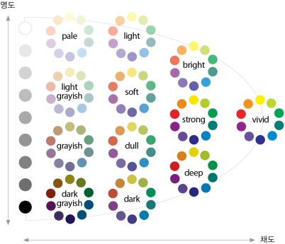

# YOUR PALLETE(가제)

: 12가지 TONE을 보여주며 원하는 색상을 COPY할 수 있는 사이트 입니다.

## 기능/특징

위 이미지를 기준으로 12가지 TONE (우선) 을 시작 페이지에서 보여준다.

마음에 드는 TONE을 누르면 대표적인 24가지 색상을 사용자에게 보여주며 원하는 색상을 클릭시 RGB코드로 복사할 수 있다.

## 구조

/ : 시작 화면, 12가지 tone의 12가지 색상을 보여줌.
/details : 고른 TONE 의 색상 24가지를 보여준다.

## 구현 예정

1. 24가지 그 이상의 색상을 보여주는 것 (... 과 같은 아이콘을 넣어서 클릭시 35가지 에서 그 이상까지 색상을 보여주거나, 랜덤으로 색상을 보여주는 방식)

2. 페이지의 background color (다크 모드정도 라도..?)

3. 랭킹 아이콘 => 많이 선택하는 색상 보여줌(이건 DB도 연결해야하고 github-pages로는 안될지도..?)
