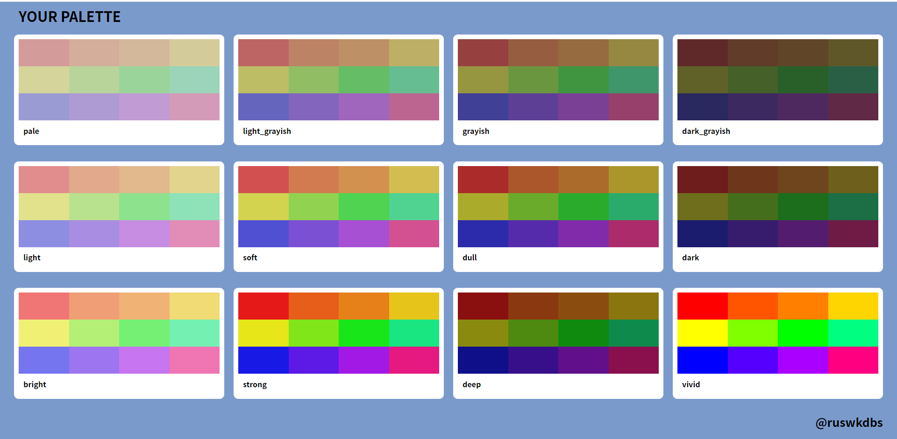

# YOUR Palette v1.0

COLOR Palette. 사용언어: HTML, CSS, JavaScript

A WebSite used for COLOR Palette, built with HTML, JavaScript, CSS

# Project Status

Static Page ver1 : (github-pages)[https://sugarsyrup.github.io/yourPalette/]

# Project Screen Shot(s)

# Installation and Setup Instructions

-

# Technologies

HTML, CSS, JavaScript
live-server[node-js]

# Reflection

NomadCoders side-project 모임.
1주일동안 진행한 소규모 프로젝트 COLOR Palette 만들기 입니다.

TONE을 주제로 정해 12가지의 TONE을 사용자 에게 보여주고, 사용자는 원하는 TONE을 클릭 그후 24가지의 색상을 보여줍니다. 원하는 색상을 선택하면 자동으로 Clip-Board에 복사 되어 붙여 넣을 수 있는 전형적인 COLOR Pallete입니다.

# To Be Implements

: React 사용이 아직 미숙해서, 일단 포기했다.
추후 React, Redux를 공부해서 특징을 살려서 페이지에 녹여 내는것이 다음 version의 목적.

- [] refactoring : React
- [] More Color or Select Hue Value
- [] Connect DB => Add Color Charts
- [] Dark Mode or Many Background Mode
